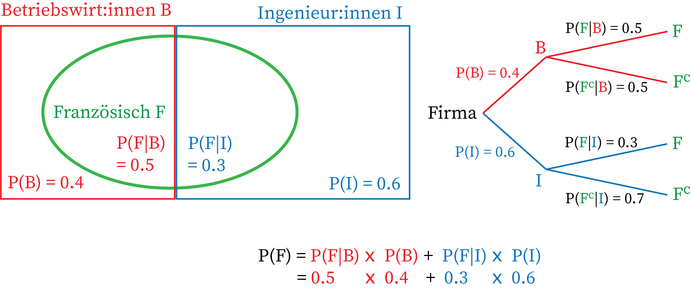

# Bedingte Wahrscheinlichkeiten & Satz von Bayes

Oft bekommen wir neue Informationen, die unsere Einschätzung verändern. Die **bedingte Wahrscheinlichkeit** $\mathbb{P}[A|B]$ beschreibt die Wahrscheinlichkeit von $A$, unter der Voraussetzung, dass $B$ bereits eingetreten ist.

**Formel:**
$$\mathbb{P}[A|B] = \frac{\mathbb{P}[A \cap B]}{\mathbb{P}[B]}$$

## Satz der totalen Wahrscheinlichkeit
Um $\mathbb{P}[A]$ zu berechnen, können wir das Problem in disjunkte Fälle (z.B. Fall $B$ und Fall $B^c$) aufteilen und gewichten:
$$\mathbb{P}[A] = \mathbb{P}[A|B] \cdot \mathbb{P}[B] + \mathbb{P}[A|B^c] \cdot \mathbb{P}[B^c]$$

Wir kennen die Fälle $B$ und $B^c$, deren Wahrscheinlichkeiten ( $\mathbb{P}[B^c], \mathbb{P}[B]$ ) und die bedingten Wahrscheinlichkeiten ( $\mathbb{P}[A|B^c], \mathbb{P}[A|B]$ ). Die Formel liefert daraus dann $\mathbb{P}[A]$.

### Beispiel 1:###
Ereignis $A$: Wir ziehen als zweite Kugel eine rote Kugel. Ereignis $B$: Wir ziehen als erste Kugel eine rote Kugel. Dann können wir die Wahrscheinlichkeit für $A$ berechnen, indem wir die Fälle $B$ und $B^c$ betrachten.

### Beispiel 2:###
In einer Firma arbeiten 60% Ingenieur:innen und 40% Betriebswirtschaftler:innen. Von den Ingenieur:
innen sprechen 30% Französisch, von den Betriebswirtschaftler:innen sind es 50%.

- Disjunkte Fälle (niemand ist beides, also disjunkt, schliessen sich gegenseitig aus):
    - $I$ = Ingenieur:in, 
    - $B$ = Betriebswirtschaftler:in 
- Wahrscheinlichkeiten: 
    - $\mathbb{P}[I] = 0.6$
    - $\mathbb{P}[I^c] = 0.4$

Der Satz der totalen Wahrscheinlichkeit erlaubt es uns, die Wahrscheinlichkeit zu berechnen, dass eine zufällig ausgewählte Person Französisch spricht, indem wir die Fälle $I$ und $B$ separat betrachten:
$$\mathbb{P}[\text{F}] = \mathbb{P}[\text{F}|B] \cdot \mathbb{P}[B] + \mathbb{P}[\text{F}|I] \cdot \mathbb{P}[I] = 0.3 \cdot 0.6 + 0.5 \cdot 0.4 = 0.38$$

## Satz von Bayes
Dieser Satz erlaubt es uns, bedingte Wahrscheinlichkeiten "umzudrehen", also von $\mathbb{P}[A|B]$ auf $\mathbb{P}[B|A]$ zu schliessen:
$$\mathbb{P}[A|B] = \frac{\mathbb{P}[B|A] \cdot \mathbb{P}[A]}{\mathbb{P}[B]}$$

*Klassisches Beispiel (Medizinischer Test):* Auch wenn ein HIV-Test sehr genau ist, ist die Wahrscheinlichkeit, tatsächlich infiziert zu sein, wenn der Test positiv ausfällt, oft überraschend tief, falls die Krankheit in der Gesamtbevölkerung sehr selten ist. 

---

# Unabhängigkeit von Ereignissen

Zwei Ereignisse $A$ und $B$ sind **unabhängig**, wenn das Eintreten des einen Ereignisses keinen Einfluss auf die Wahrscheinlichkeit des anderen hat.

**Bedingung für Unabhängigkeit:** Die Wahrscheinlichkeit des gemeinsamen Eintretens von $A$ und $B$ ist gleich dem Produkt ihrer Einzelwahrscheinlichkeiten:
$$\mathbb{P}[A \cap B] = \mathbb{P}[A] \cdot \mathbb{P}[B]$$

Wenn Ereignisse unabhängig sind, gilt logischerweise auch: $\mathbb{P}[A|B] = \mathbb{P}[A]$.