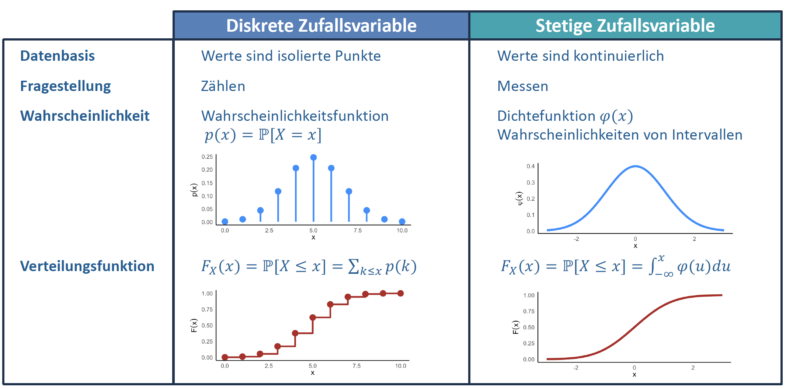

# Was ist eine Zufallsvariable?

Eine **Zufallsvariable** (oft mit grossen Buchstaben wie $X$, $Y$ bezeichnet) ist im Prinzip eine Übersetzungsmaschine: Sie ordnet den abstrakten Ergebnissen eines Zufallsexperiments (der Grundmenge $\Omega$) reelle Zahlen zu. 

Wir unterscheiden zwei Haupttypen:

* **Diskrete Zufallsvariablen:** Können nur bestimmte, zählbare Werte annehmen (oft ganze Zahlen).
  * *Beispiel:* Anzahl der geworfenen "Köpfe" bei 10 Münzwürfen ($X \in \{0, 1, 2, \dots, 10\}$).
* **Stetige (kontinuierliche) Zufallsvariablen:** Können jeden beliebigen Wert in einem bestimmten Intervall annehmen (Messwerte).
  * *Beispiel:* Die exakte Wartezeit auf den Bus in Minuten ($X = 4.352\dots$).

---

# Wahrscheinlichkeits- und Verteilungsfunktion

Um zu beschreiben, wie wahrscheinlich die verschiedenen Werte einer Zufallsvariablen sind, nutzen wir Funktionen.

## Bei diskreten Zufallsvariablen
* **Wahrscheinlichkeitsfunktion:** Gibt die exakte Wahrscheinlichkeit an, dass die Zufallsvariable $X$ einen ganz bestimmten Wert $x$ annimmt.
  $$P(X = x)$$
* **Verteilungsfunktion (kumulativ):** Kumuliert (summiert) die Wahrscheinlichkeiten bis zu einem bestimmten Wert $x$. 
  $$F(x) = P(X \le x)$$

  Die Kurve "beginnt" somit bei $y=0$ und "endet" bei $y=1$ und ist monoton wachsend (geht nie wieder abwärts in Richtung von höheren X).

## Bei stetigen Zufallsvariablen
* **Dichtefunktion:** Da ein stetiger Wert unendlich viele Nachkommastellen hat, ist die Wahrscheinlichkeit für einen *exakten* Wert immer null ($P(X = x) = 0$). Die Dichtefunktion beschreibt stattdessen die "Kurve". Die Gesamtfläche unter der Kurve ist immer exakt 1.
* **Verteilungsfunktion (kumulativ):** Die Kurve ist ebenfalls monoton wachsend und gibt die Fläche unter der Dichtefunktion bis zum Wert $x$ an. Berechnet wird dies über das Integral der Dichtefunktion.
$$F(x) = \int_{-\infty}^{x} f(t) \, dt$$

## Visuelle Zusammenfassung

# Unabhängigkeit von Zufallsvariablen

Zwei Zufallsvariablen $X$ und $Y$ sind **unabhängig**, wenn das Eintreten der einen Zufallsvariablen absolut keinen Einfluss auf die Wahrscheinlichkeitsverteilung der anderen hat. 

**Formal gilt für unabhängige Zufallsvariablen:**

* **Gemeinsame Wahrscheinlichkeit:** Die Wahrscheinlichkeit, dass beide Ereignisse eintreten, ist das Produkt ihrer Einzelwahrscheinlichkeiten:
  $$P(X \le x \text{ und } Y \le y) = P(X \le x) \cdot P(Y \le y)$$

  oder ausgedrückt in der Verteilungsfunktion 

  $$F_{X,Y}(x,y) = F_X(x) \cdot F_Y(y)$$

---
