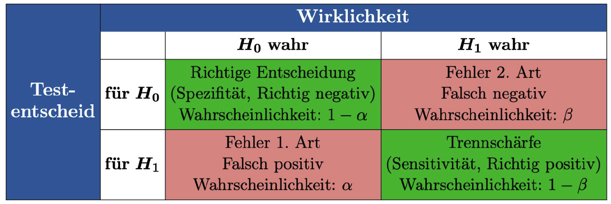
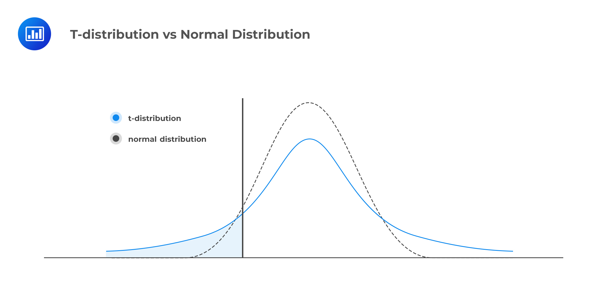

# Einführung in Hypothesentests

Ein statistischer Hypothesentest ist ein Verfahren, um anhand von Daten zu entscheiden, ob eine bestimmte Annahme (Hypothese) über die Grundgesamtheit haltbar ist oder nicht.

## Die Grundidee: Das Gerichtsverfahren
Man kann sich einen Hypothesentest wie ein Gerichtsverfahren vorstellen:

* **Nullhypothese ($H_0$):** Der Angeklagte ist unschuldig (Status Quo, kein Effekt).
* **Alternativhypothese ($H_1$):** Der Angeklagte ist schuldig (neue Entdeckung, ein Effekt liegt vor).
* **Ziel:** Wir suchen nach "Beweisen" (Daten), die so stark gegen $H_0$ sprechen, dass wir die Unschuldsvermutung aufgeben müssen.

## Fehlerarten beim Testen
Da wir nur eine Stichprobe betrachten, können wir Fehlentscheidungen treffen:

| Fehler | Bezeichnung | Bedeutung |
| :--- | :---: | :--- |
| **Fehler 1. Art** | $\alpha$ (Signifikanzniveau) | $H_0$ wird abgelehnt, obwohl sie wahr ist ("falscher Alarm"). |
| **Fehler 2. Art** | $\beta$ | $H_0$ wird beibehalten, obwohl $H_1$ wahr ist ("verpasster Effekt"). |

Das Signifikanzniveau $\alpha$ (meist 5%) legt fest, wie hoch das Risiko für einen Fehler 1. Art maximal sein darf.



## Der p-Wert
Der p-Wert ist die Wahrscheinlichkeit, ein Stichprobenresultat zu erhalten, das mindestens so extrem ist wie das beobachtete, unter der Annahme, dass $H_0$ wahr ist.

* **$p < \alpha$:** Das Ergebnis ist signifikant $\rightarrow H_0$ wird abgelehnt.
* **$p \ge \alpha$:** Das Ergebnis ist nicht signifikant $\rightarrow H_0$ wird beibehalten.

## Die Macht eines Tests
Die Macht (Power) eines Tests ist die Wahrscheinlichkeit, dass der Test $H_0$ ablehnt, wenn tatsächlich $H_1$ wahr ist. Also wie wahrscheinlich detektieren wir einen echten Effekt?
Sie hängt von der Effektgröße, der Stichprobengröße und dem Signifikanzniveau ab.
---

# Der t-Test

Der t-Test wird verwendet, um Hypothesen über Mittelwerte ($\mu$) zu prüfen, wenn die Varianz der Grundgesamtheit unbekannt ist.

## Einstichproben-t-Test
Man vergleicht den Mittelwert einer Stichprobe mit einem fest vorgegebenen Sollwert $\mu_0$.

**Beispiel:** Eine Tablette soll 100 mg Wirkstoff enthalten. Wir testen, ob die Produktion systematisch davon abweicht.

* $H_0: \mu = 100$
* $H_1: \mu \neq 100$ (zweiseitig)

### Teststatistik $T$:
Die Teststatistik ist der "Prüfwert", den wir berechnen, um zu sehen, wie weit unsere Daten vom erwarteten Wert ($\mu_0$) entfernt liegen.
$$T = \frac{\overline{X} - \mu_0}{S / \sqrt{n}}$$

* **$\overline{X}$**: Der beobachtete Durchschnitt deiner Stichprobe.
* **$\mu_0$**: Der hypothetische Sollwert aus der Nullhypothese $H_0$.
* **$S$**: Die Standardabweichung der Stichprobe.
* **$n$**: Die Anzahl der Beobachtungen.

### Warum unterscheidet sich $T$ vom Stichprobenmittelwert?
Während der Mittelwert $\overline{X}$ in der Originaleinheit (z. B. mg, cm, kg) gemessen wird, ist $T$ eine **standardisierte Maßzahl**.

* **Verschiebung (Zentrierung):** Wir berechnen die Differenz $(\overline{X} - \mu_0)$. Das sagt uns, wie groß die Abweichung absolut ist.
* **Maßstabsanpassung (Standardisierung):** Wir teilen durch den Standardfehler ($S / \sqrt{n}$). $T$ misst also nicht in Zentimetern, sondern in **Standardfehlern**.
* Ein $T$-Wert von 2 bedeutet: "Unser Stichprobenmittelwert liegt 2 Standardfehler weit weg vom Sollwert."
* Dies macht Ergebnisse vergleichbar, egal was wir für Dinge messen.

### Warum t-Verteilung statt Normalverteilung?
Nach dem Zentralen Grenzwertsatz sind Mittelwerte bei großen Stichproben zwar normalverteilt, aber es gibt einen Haken: **Die Varianz**.

* Wüssten wir die wahre Varianz $\sigma^2$ der Grundgesamtheit, dürften wir die Normalverteilung nutzen.
* In der Realität müssen wir $\sigma^2$ aber durch die Stichprobenvarianz $S^2$ **schätzen**.
* Diese Schätzung ist unsicher, besonders bei kleinen Stichproben.

Die t-Verteilung korrigiert diese Unsicherheit. Sie hat im Vergleich zur Normalverteilung **"Fat Tails"** (breitere Ränder). Das bedeutet, dass extreme Abweichungen bei kleinen Stichproben öfter vorkommen können. Je größer die Stichprobe $n$ wird, desto ähnlicher wird die t-Verteilung der Normalverteilung.



### So wird das Resultat unseres Einstichproben-t-Tests berechnet:
1. Setze ein Signifikanzniveau $\alpha$ (z.B. 0.05).
2. Bestimme die Freiheitsgrade: $df = n - 1$.
3. Unser Signifikanzniveau und unsere Freiheitsgrade definieren eine t-Verteilung, auf der wir nun testen.
4. Wir bestimmen die kritischen Werte für die Ablehnungsbereiche: `qt(1 - alpha/2, df)` (zweiseitige Tests).
4. Berechnete den $T$-Wert unserer Stichprobe und vergleiche ihn mit dem kritischen Wert aus der t-Verteilung. Liegt der $T$-Wert außerhalb des kritischen Bereichs, lehnen wir $H_0$ ab.

In R können wir diesen Test mit der Funktion `t.test()` durchführen, welche die oben genannten Schritte automatisch erledigt.

**In R:** 
```r
t.test(stichprobe, alternative = "two.sided", mu = 100, conf.level = 0.95)
```

**Der resultierende p-Wert** gibt an, wie wahrscheinlich es ist, ein so extremes Ergebnis zu erhalten, wenn $H_0$ wahr ist. Ein p-Wert kleiner als $\alpha$ führt zur Ablehnung von $H_0$, das heisst es gibt eine systematische Abweichung von 100 mg, wenn der p-Wert kleiner als unser Signifikanzniveau ist.


## Zweistichproben-t-Test (Unabhängig)
Vergleicht die Mittelwerte zweier unabhängiger Gruppen (z.B. Behandlungsgruppe vs. Kontrollgruppe).

* **Voraussetzung:** Beide Gruppen sind normalverteilt.
* **Varianz:** Man unterscheidet, ob die Varianzen der beiden Gruppen gleich oder verschieden sind (Welch-Test).

## Gepaarter t-Test
Wird verwendet, wenn Messwerte paarweise zusammengehören (z.B. Messung vor und nach einem Training bei derselben Person). Hierbei wird der t-Test auf die Differenzen der Paare angewendet.

---

# Durchführung in R

R bietet eine zentrale Funktion für alle Varianten des t-Tests: `t.test()`.

```r
# Einstichproben-t-Test
t.test(stichprobe, mu = 100)

# Zweistichproben-t-Test (unabhängig)
t.test(gruppe1, gruppe2, paired = FALSE)

# Gepaarter t-Test
t.test(messung_vorher, messung_nachher, paired = TRUE)
```