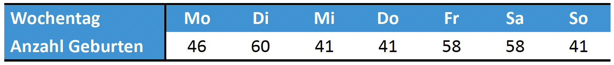
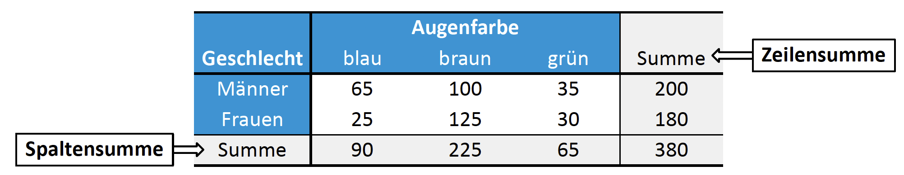
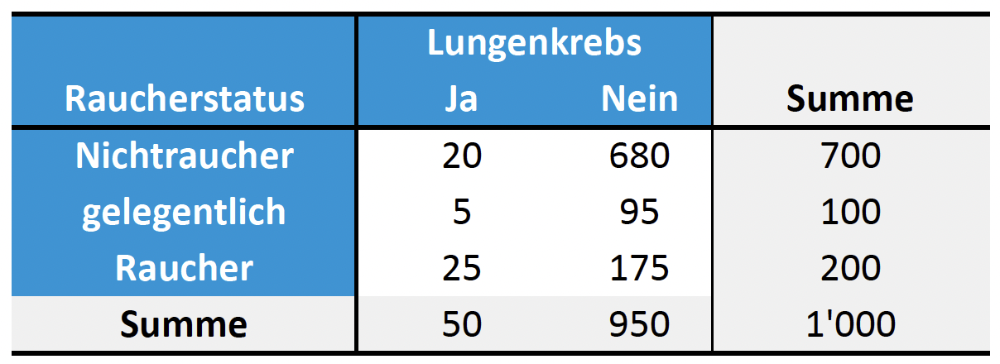

## Einführung in den Chi-Quadrat-Test

Der $\chi^2$-Test (Chi-Quadrat-Test) nach Pearson umfasst eine Gruppe von statistischen Tests, die speziell für die Analyse kategorieller Daten entwickelt wurden. Je nach Fragestellung wird zwischen drei Hauptvarianten unterschieden:

1. **Verteilungs- oder Anpassungstest (Goodness-of-Fit):** Untersucht, ob eine vorliegende Stichprobe einer spezifizierten theoretischen Verteilung folgt.
2. **Homogenitätstest:** Prüft, ob zwei oder mehr unabhängige Stichproben der gleichen Verteilung entstammen bzw. aus derselben Grundgesamtheit kommen.
3. **Unabhängigkeitstest:** Analysiert, ob zwei Merkmale stochastisch unabhängig voneinander sind.

## Chi-Quadrat Anpassungstest

Der Anpassungstest vergleicht beobachtete Häufigkeiten mit theoretisch erwarteten Häufigkeiten. 

**Beispiel: Geburtenverteilung**
In einem Spital wurde die Anzahl der Geburten pro Wochentag erfasst. Es soll auf einem Signifikanzniveau von $\alpha=0.05$ geprüft werden, ob die Geburten gleichmässig über die Wochentage verteilt sind.

* **Nullhypothese ($H_0$):** Die Geburten sind über die Wochentage gleichverteilt.
* **Wahrscheinlichkeit unter $H_0$:** Eine Geburt findet an einem bestimmten Wochentag mit der Wahrscheinlichkeit von $1/7$ statt.
* **Alternativhypothese ($H_1$):** Die Anzahl der Geburten ist nicht gleichverteilt.

In R wird dieser Test mit der Funktion `chisq.test(x, p)` durchgeführt, wobei `x` die Stichprobendaten und `p` die Wahrscheinlichkeiten darstellen. 

## Chi-Quadrat Homogenitätstest

Dieser Test untersucht $m$ unabhängige Zufallsstichproben diskreter Merkmale mit $k$ Ausprägungen. Die Nullhypothese besagt, dass alle Stichproben dieselbe Verteilung besitzen.

**Kontingenztafeln und Erwartungswerte**
Zur Durchführung wird eine Kontingenztafel benötigt, welche die absoluten oder relativen Häufigkeiten der Merkmalskombinationen darstellt (siehe Beispiel weiter unten).

* Die erwarteten Zellhäufigkeiten ($E_{ij}$) unter der Nullhypothese berechnen sich aus den Randverteilungen: $E_{ij}=\frac{n_{i\bullet} \cdot n_{\bullet j}}{n}$.
* Die Teststatistik ergibt sich aus der Summe der quadrierten Differenzen zwischen beobachteten ($n_{ij}$) und erwarteten Werten, gewichtet mit den erwarteten Werten: $X^2=\sum_{i=1}^{m}\sum_{j=1}^{k}\frac{(n_{ij}-E_{ij})^2}{E_{ij}}$.
* Die Statistik ist approximativ $\chi^2$-verteilt mit $(k-1) \cdot (m-1)$ Freiheitsgraden.

**Beispiel: Augenfarbe nach Geschlecht**
Es wird untersucht, ob sich die Verteilung der Augenfarben (blau, braun, grün) zwischen Männern und Frauen unterscheidet.

Nach der Berechnung der Kontingenztafel: in R mit `chisq.test(kontingenztafel)` ergibt sich eine Teststatistik von 19.943 bei 2 Freiheitsgraden und einem sehr kleinen p-Wert von 0.00004672. Bei einem Signifikanzniveau von $\alpha=0.05$ wird die Nullhypothese verworfen.

## Chi-Quadrat Unabhängigkeitstest

Dieser Test prüft, ob zwei Faktoren stochastisch unabhängig sind.

* **Nullhypothese:** Die beiden Faktoren sind unabhängig voneinander.
* **Alternativhypothese:** Die beiden Faktoren sind abhängig.

Die methodische Durchführung und die Berechnung der Kontingenztafel erfolgen analog zum Homogenitätstest.

**Beispiel: Lungenkrebs und Raucherstatus**
Es wird bei 1000 Personen untersucht, ob das Auftreten von Lungenkrebs vom Raucherstatus (Nichtraucher, gelegentlich, Raucher) abhängt.

Wir führen in R einen Chi-Quadrat-Unabhängigkeitstest mit `chisq.test(kontingenztafel)` durch und erhalten folgende Ergebnisse:

* Der Test liefert einen p-Wert nahe 0 (0.0000002441).
* Folglich wird die Nullhypothese verworfen.
* Es besteht eine Abhängigkeit zwischen dem Raucherstatus und Lungenkrebs.

::: {.callout-warning}
### Gleicher Test für zwei verschiedene Fragestellungen?
Die gleiche Kontingenztafel under der gleiche Befehl `chisq.test(kontingenztafel)` kann sowohl für einen Homogenitätstest als auch für einen Unabhängigkeitstest verwendet werden. Der Unterschied liegt in der Interpretation der Hypothesen:

* **Homogenitätstest:** Es wird geprüft, ob die Verteilung der Augenfarben bei Männern und Frauen gleich ist.
* **Unabhängigkeitstest:** Es wird geprüft, ob es eine Abhängigkeit zwischen Geschlecht und Augenfarbe gibt.

Der P-Wert und die Teststatistik ist in beiden Fällen gleich, aber die Schlussfolgerungen bezüglich der Hypothesen sind unterschiedlich.
:::

## Voraussetzungen und Faustregeln

Damit die berechnete Teststatistik zuverlässig durch die Chi-Quadrat-Verteilung approximiert werden kann, sollten folgende Faustregeln erfüllt sein:

* Die Gesamtstichprobe muss ausreichend gross sein, d.h. $n > 30$.
* Keine der erwarteten Zellhäufigkeiten ($E_{ij}$) darf kleiner als 1 sein.
* Mindestens **80%** der erwarteten Zellhäufigkeiten müssen grösser als 5 sein.
* Sind diese Bedingungen nicht erfüllt, wird empfohlen, bestimmte Merkmalsausprägungen zusammenzufassen.